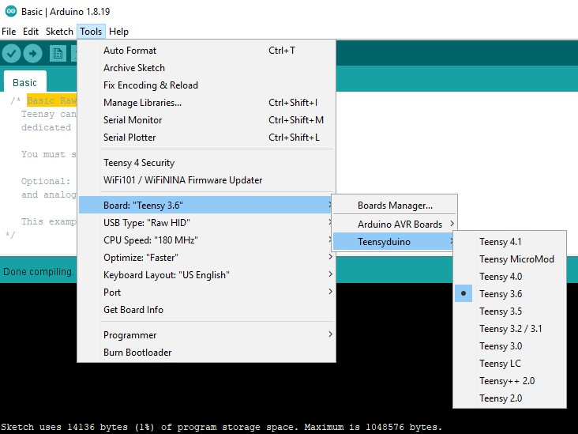

# RETracker

`RETracker` is a reverse engineering framework for the [Polyend Tracker](https://polyend.com/tracker/) written in Python.
It is based on unofficial patches that are applied to the vendor's stock firmware.
These patches introduce a custom USB handler by replacing the Tracker's existing but unused USB RAWHID handler. 

The `RETracker's` custom USB handler introduces new, non-official features to the `Polyend Tracker` that can be controlled from a computer via USB and also brings back file transfer functionality that has been [disabled by Polyend with the introduction of firmware v1.4.0](https://github.com/polyend/TrackerBetaTesting/releases/tag/1.4.0).


Once patched, the firmware's new features comprise the following:
* Reading/dumping of memory
* Writing/patching of memory
* Execution of custom code/redirection of control flow
* Writing files to the tracker's SD card

These features are a solid base for adding further functions dynamically to the `Polyend Tracker`, by assembling position-independend code on the host, transferring it to the Tracker and having the new USB handler execute the freshly implanted code. There are a few intial [demos](polyp/) available that can be transferred dynamically to the device.

Adding to that, the memory reading/writing functions allow the USB host to inspect the `Tracker's` memory by creating hex-dumps or by disassembling code in ARM or Thumb mode.

Finally, the new file transfer function allows arbitrary files, such as firmware updates or `NES` roms to be copied to the Tracker, without having to go through the intended process of swapping the SD card between the `Tracker` and a computer. Currently the only direction supported is *from* the USB host *to* the `Tracker's` SD card, however.

HAPPY HACKING!
## Installation
First of all, on top of a Python 3 installation, RETracker requires a number of [dependencies](DEPENDENCIES.md) to be installed.
Please check them out and make sure you have them all installed before you go on.

Once all dependencies are installed, a patched firmware can be created by running [fwtool.py](fwtool.py).

```
# python fwtool.py
usage: fwtool.py [-h] [-b | -u | -p] infile outfile

positional arguments:
  infile        name/path of input file
  outfile       name/path of output file

optional arguments:
  -h, --help    show this help message and exit
  -b, --build   apply RETracker patches to Tracker firmware
  -u, --unpack  unpack Tracker firmware (.ptf) to binary format
  -p, --pack    create Tracker firmware (.ptf) from binary
```
Example:
```
# python fwtool.py -b ..\PolyendTracker_1.5.0.ptf ..\PolyendTracker_1.5.0_retracker.ptf
Opening ..\PolyendTracker_1.5.0.ptf
MD5: ce894299bc35996186528364951c901e
Found 1 patch
Assembling patch #1
Description: "Memory dumping/patching/code execution/file transfer via USB"
Decoding input file
Applying patch
Creating output file: ..\PolyendTracker_1.5.0_retracker.ptf
Done
```
Once a firmware is successfully built, it should be copied to the Tracker's `"/firmware/"` folder on the root of its SD card.
The firmware image's file name must start with `PolyendTracker_` and end with `.ptf` or otherwise, the Tracker won't find it.
The firmware flashing procedure is straight forward and doesn't differ from the ordinary process.

On the device
* press the `config` button
* go to the `Firmware` menu
* enter the `Firmware update` sub menu
* choose the firmware you would like to flash onto the `Polyend Tracker`

>ACHTUNG!!!
>
>It is expected for the UI to behave differently when flashing a patched firmware.
This is probably due to differences in the IntelHex format that `fwtool.py` creates, which hasn't been looked into, yet (simply because it still leads to a successfully flashed firmware).
>
>Please patiently wait for the update to finish until the device reboots.
In case something still went wrong, please consult the `Polyend Tracker` user manual, which explains the steps on how to enter the `emergency update procedure`.
>
>n.b.: I've gone through numerous failed update procedures during development myself and haven't had a single issue with restoring a good firmware using the `emergency update procedure`.
>However, I wouldn't recommend using `RETracker` before having made backups of the Tracker's SD card (projects, samples, ...).

## Supported Firmware Versions
RETracker currently supports `Polyend Tracker` in firmware version 1.5.0, which is the most recent firmware as of this writing.

## How does it work?
Polyend Tracker firmware images ship in IntelHex format.
[fwtool.py](fwtool.py) converts the firmware to its plain binary format, which holds all the firmware's code and data.
It then applies patches to the converted binary according to information found in [tracker/firmware.py](tracker/firmware.py) before converting the file back to IntelHex format again.
From there on, the `Polyend Tracker` can be communicated with by plugging it into a USB port of a computer running [retracker.py](retracker.py).

## RETracker Usage
The main workhorse of this project probably is `retracker.py`, which provides a command line interface to the user.
```
# python retracker.py -h
usage: retracker.py [-h] [-b] [-c] [-r ADDRESS SIZE FILE] [-w ADDRESS DATA] [-x ADDRESS SIZE] [-d ADDRESS SIZE]
                    [-a POLYP] [--polypargs POLYPARGS [POLYPARGS ...]] [-e ADDRESS] [-t SRC_FILENAME DST_FILENAME]

optional arguments:
  -h, --help            show this help message and exit
  -b                    break
  -c                    continue
  -r ADDRESS SIZE FILE, --readmem ADDRESS SIZE FILE
                        Save memory to local file
  -w ADDRESS DATA, --writemem ADDRESS DATA
                        Write hex-encoded data to memory ADDRESS
  -x ADDRESS SIZE, --hexdump ADDRESS SIZE
                        Create hex-dump of memory
  -d ADDRESS SIZE, --disassemble ADDRESS SIZE
                        Disassemble code at ADDRESS (ARM/Thumb aware)
  -a POLYP, --assemble POLYP
                        Assemble and execute POLYP patchfile
  --polypargs POLYPARGS [POLYPARGS ...]
                        Optional arguments that can be passed to a POLYP
  -e ADDRESS, --exec ADDRESS
                        Execute code at ADDRESS (ARM/Thumb aware)
  -t SRC_FILENAME DST_FILENAME, --transfer SRC_FILENAME DST_FILENAME
                        Transfer SRC_FILENAME to Tracker's DST_FILENAME

Examples:
Dump memory to file:        retracker.py -r 70100000 4f0 dump.bin
Write data to memory:       retracker.py -w 70100000 "41 EC FA414142c0"
Hex-dump:                   retracker.py -x 0 ffff
Disassemble:                retracker.py -d 3c01 c000
Assemble and run Polyp:     retracker.py -a polyp.scroller --polypargs "hi there!"
Run code in Thumb mode:     retracker.py -e 70100001
Run code in ARM mode:       retracker.py -e 70100000
Transfer file to Tracker:   retracker.py -t PolyendTracker_1.5.0.ptf Firmware/PolyendTracker_cstm.ptf
```
Examples:
```
# python retracker.py -d 0002B99d 100
Connected to Polyend Tracker
Detected fw patch v0.3.0 on Tracker firmware v1.5.0

Disassembling 0002B99C-0002BA9C in Thumb mode

0x0002B99C:     push    {r4}
0x0002B99E:     ldr     r4, [pc, #0x6c]
0x0002B9A0:     umull   ip, r4, r4, r1
0x0002B9A4:     lsrs    r4, r4, #3
0x0002B9A6:     add.w   r1, r1, r4, lsl #2
0x0002B9AA:     uxtb    r1, r1
0x0002B9AC:     cmp     r3, #0x1f
0x0002B9AE:     ite     ls
0x0002B9B0:     addls   r4, r0, r3
0x0002B9B2:     addhi.w r4, r0, #0x1f
0x0002B9B6:     adds    r3, r0, r1
0x0002B9B8:     ldrb    r4, [r4, #5]
0x0002B9BA:     strb.w  r4, [r3, #0xc8]
0x0002B9BE:     cbz     r2, #0x2b9e4
0x0002B9C0:     add.w   r2, r0, r1, lsr #3
```

```
# python retracker.py -x 0002B99d 100
Connected to Polyend Tracker
Detected fw patch v0.3.0 on Tracker firmware v1.5.0

Dumping 0002B99D-0002BA9D

0002b99d  b4 1b 4c a4 fb 01 c4 e4  08 01 eb 84 01 c9 b2 1f  |..L.............|
0002b9ad  2b 94 bf c4 18 00 f1 1f  04 43 18 64 79 83 f8 c8  |+........C.dy...|
0002b9bd  40 8a b1 00 eb d1 02 01  23 92 f8 b6 40 01 f0 07  |@.......#...@...|
0002b9cd  01 03 fa 01 f1 21 43 82  f8 b6 10 01 23 5d f8 04  |.....!C.....#]..|
0002b9dd  4b 80 f8 b5 30 70 47 00  eb d1 04 01 22 94 f8 b6  |K...0pG....."...|
0002b9ed  30 01 f0 07 01 02 fa 01  f1 23 ea 01 01 84 f8 b6  |0........#......|
0002b9fd  10 01 23 5d f8 04 4b 80  f8 b5 30 70 47 00 bf ab  |..#]..K...0pG...|
0002ba0d  aa aa aa 00 eb 01 0c 8c  f8 c8 30 82 b1 00 eb d1  |..........0.....|
0002ba1d  02 01 23 92 f8 b6 c0 01  f0 07 01 03 fa 01 f1 41  |..#............A|
0002ba2d  ea 0c 01 01 23 82 f8 b6  10 80 f8 b5 30 70 47 00  |....#.......0pG.|
0002ba3d  eb d1 0c 01 22 9c f8 b6  30 01 f0 07 01 02 fa 01  |...."...0.......|
0002ba4d  f1 23 ea 01 01 01 23 8c  f8 b6 10 80 f8 b5 30 70  |.#....#.......0p|
0002ba5d  47 00 bf 0f 49 00 23 30  b5 01 f1 3f 05 1c 46 4f  |G...I.#0...?..FO|
0002ba6d  f0 01 0e 01 e0 11 f8 01  3f c2 18 00 eb d3 0c 82  |........?.......|
0002ba7d  f8 c8 40 9c f8 b6 20 03  f0 07 03 0e fa 03 f3 22  |..@... ........"|
0002ba8d  ea 03 03 a9 42 8c f8 b6  30 ec d1 80 f8 b5 e0 30  |....B...0......0|
```

Whereas some of the more common command line options allow memory to be written, read and hex-dumped, the more exciting features are probably the `-e` and `-a` options.
They allow code to be executed on the device.

The `-e` option allows existing firmware code to be branched to directly, or custom code after writing it to the device's memory using the `-w` option.
The lowest bit of an `address` argument passed to the `retracker.py` command line utility specifies whether or not to use Thumb mode (0: ARM mode, 1: Thumb mode).

The `-a` command line argument accepts so called `Polyps`, which are Python modules containing patches for the `Polyend Tracker` in the form of assembly routines and version-specific offsets and data.

Loading any of these modules using the `-a` command line option causes their assembly routines
* to be assembled on the fly
* transferred to the connected device
* executed on the connected device

Example:
```
# python retracker.py -a polyp.scroller
Connected to Polyend Tracker
Detected fw patch v0.3.0 on Tracker firmware v1.5.0

Assembling patch #1
Description: "Text scroller on the Tracker's pads"
Target address: 70100000
Mode: thumb
Patching memory
Running code...
Done
```

This does not only allow for convenient and sped-up development of custom code and features, it also does not require new firmware to be flashed onto the `Tracker` for testing new functionality (but a reboot in the worst case).

Please have a look at the available modules in the [polyp/](polyp/) folder, which contains a few initial demos that fade the `Tracker's` screen in and out or repurpose its pads as a text-scroller canvas.

## Reverse Engineering the Tracker
The `Polyend Tracker` is believed to be based on a µc similar to the Teensy 3.6 of which [data sheets and other tech info is available here](https://www.pjrc.com/store/teensy36.html).
Be sure to check out the [MK66FX](https://www.pjrc.com/teensy/K66P144M180SF5RMV2.pdf) manual for a memory map in order to avoid running into device crashes when dumping memory.

The `Tracker` firmware image is in IntelHex format and can be unpacked using [fwtool.py](fwtool.py) or loaded directly by disassemblers supporting the IntelHex format, such as the [IDA Pro disassembler](https://hex-rays.com/ida-pro/ida-disassembler/) and probably others such as [GHIDRA](https://ghidra-sre.org/) or [Binary Ninja](https://binary.ninja/).
The processor module to choose is ARM / little-endian.
The firmware should be loaded at address 0. Address/offset 4 is the the reset vector with a pointer to the reset vector handler (start disassembling there).
Most, if not all of its code runs in Thumb mode.
I've found address `0x70100000` and above to be a reliable address to plant a `Polyp` into and run its code from there.

If you'd like to give firmware development a go, grab a copy of both [Arduino and the Teensyduino addon](https://www.pjrc.com/teensy/td_download.html), build some of the examples and flash the resulting `.hex` files onto the Tracker (be sure to pick `Teensy 3.6` and rename the resulting `.hex` file into something like `PolyendTracker_teensy.ptf`).
Going back to an original `Polyend Tracker` firmware will be possible anytime using the Tracker's emergency update procedure, since it resides on a separate chip that isn't affected/overwritten by firmware updates.



## RETracker Wiki
The RETracker wiki can be found [here](https://github.com/patois/RETracker/wiki).

## Disclaimer
The author does not take any responsibility for any damage this project may cause to your Polyend Tracker.
By using RETracker or any information derived, you agree that you are using any of this project's code, data and other information at your own risk.
